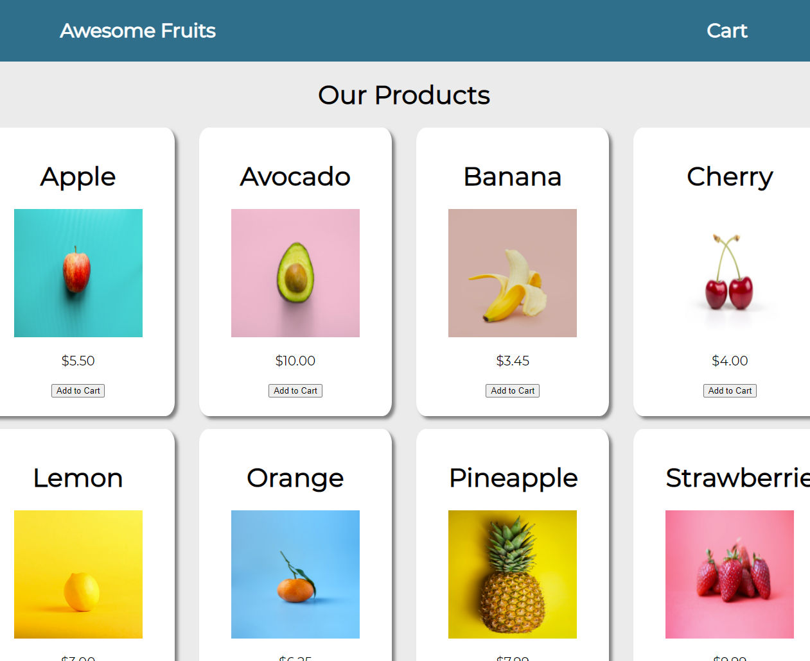

# [Ecommerce Practice Fruit Shop](https://fruit-selling-site.herokuapp.com/)

This site, made using React, is a store to buy fruits. The site utilizes Redux to keep track of what is added to or removed from the cart throughout the site's different pages. Also the site utilizes local storage to have a persistent cart when reloading the page.

All the items and information are pulled from a MongoDB database and displayed on the page. Each item can be clicked to view more details about the respective item. In the cart page, the quantity of a particular item can be increased or decreased.

## To Add

- Add a checkout page where the user can checkout the items in the cart.
